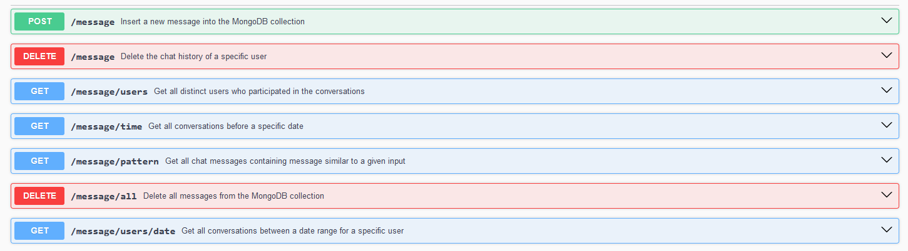
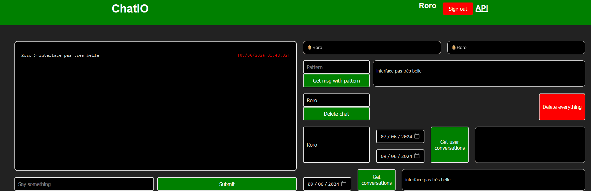
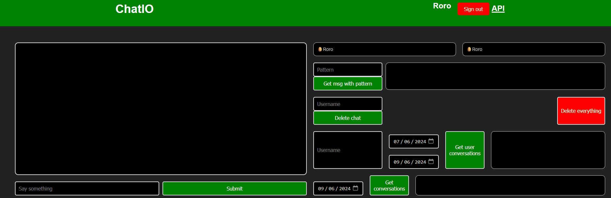
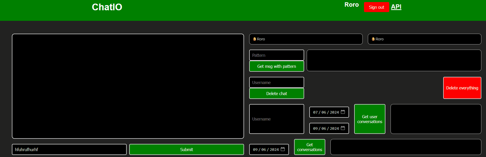

# TP noté mongodb/web

## Objectif :

Combiner le tp socket + passport oath pour réaliser un chat en temp réel avec les messages stockés en bdd

## Structure

### Backend :

On y retrouve l'api mongodb avec un swagger pour tester les routes sur le port 3030



Elles fonctionnent toutes

Dans le dossier backend, l'on a un controller, routes, dao (le model sert à rien). Il est lancé dans index.js

```js
const express = require('express');
const cors = require('cors');
const dotenv = require('dotenv');
const mongodb = require('mongodb');
const MessageDAO = require('./dao/MessageDAO.js');
const swaggerJsdoc = require("swagger-jsdoc");
const swaggerUi = require("swagger-ui-express");
const MessageRoute = require('./api/routes/chat.js');

const app = express();

class Index {
    static app = express();
    static router = express.Router();

    static createServer() {
        Index.app.use(cors({origin: 'http://localhost:3000'}));
        Index.app.use(express.json());

        const swaggerOption = {
            swaggerDefinition: (swaggerJsdoc.Options = {
                info: {
                    title: "my-users app", description: "API documentation", contact: {
                        name: "LLAURET",
                    }, servers: ["http://localhost:3030/"],
                },
            }), apis: ["./api/routes/*.js"],
        };

        const swaggerDocs = swaggerJsdoc(swaggerOption);
        MessageRoute.configRoutes(Index.router);
        Index.app.use('/', Index.router);
        Index.app.use("/api-docs", swaggerUi.serve, swaggerUi.setup(swaggerDocs));
        // Index.app.use("*", (req, res) => {
        //     res.status(404).json({error: "Not Found"});
        // });
    }

    static async initDatabase() {
        const client = new mongodb.MongoClient(process.env.DB_URI);
        const port = process.env.PORT || 3030;
        try {
            await client.connect();
            console.log("Connected to db");
            await MessageDAO.connectDB(client);
            console.log("Référence créée avec succès");
            // console.log("MoviesDAO.movies: ", MoviesDAO.movies);
            Index.app.listen(port, () => {
                console.log(`Server is running on port ${port}`);
            });
        } catch (error) {
            console.log("Error db connection: ", error);
            process.exit(1);
        }
    }

    static main() {
        dotenv.config();
        Index.createServer();
        Index.initDatabase().then(r => console.log("salut"));
    }
}

Index.main();
```

### Front

On retrouve l'implémentation de passport et de socket

L'on a aussi des boutons pour se log ou register sans Google, avec des requetes sqlite pour vérifier si l'user existe ou
non etc.

### Démonstration

#### Partie chat

Quand un message est envoyé il est directement envoyé à la bdd via l'api avec fetch à l'endpoint message

```js
fetch('http://localhost:3030/message', {
    method: 'POST',
    headers: {
        'Content-Type': 'application/json',
    },
    body: JSON.stringify({
        username: socket.username,
        message: $message.val(),
        date: new Date().toISOString(),
    }),
})
    .then(response => response.json())
    .then(data => console.log('Message ajouté avec succès:', data))
    .catch((error) => {
        console.error('Erreur:', error);
    });
```


#### Actions du chat

# Obtenir un message avec un pattern

```js
$getMsgWithPattern.click(function () {
    const pattern = $pattern.val();
    fetch(`http://localhost:3030/message/pattern?pattern=${pattern}`)
        .then(response => response.json())
        .then(data => {
            const msgWithPatternDiv = document.getElementById('msgWithPattern');
            msgWithPatternDiv.innerHTML = '';
            data.forEach(msg => {
                const p = document.createElement('p');
                p.textContent = msg.message;
                msgWithPatternDiv.appendChild(p);
            });
        })
        .catch(error => console.error('Error:', error));
});
```

```
static async getMessageWithPattern({pattern}) {
        try {
            return await MessageDAO.messages.find({message: {$regex: pattern}}).toArray();
        } catch (e) {
            console.error(`Unable to get messages with pattern: ${e}`);
            return {error: e};
        }
    }
```


# Supprimmer un chat d'un user

```js
$deleteChat.click(function () {
    const username = $usernameDelete.val();
    fetch(`http://localhost:3030/message?username=${username}`, {
        method: 'DELETE',
        headers: {
            'Content-Type': 'application/json',
        },
    })
        .then(response => response.json())
        .then(data => console.log('Chat supprimé avec succès:', data))
        .catch((error) => {
            console.error('Erreur:', error);
        });
});
```

```
    static async deleteMessagesFromUser({username}) {
        try {
            return await MessageDAO.messages.deleteMany({username});
        } catch (e) {
            console.error(`Unable to delete messages from user: ${e}`);
            return {error: e};
        }
    }
```



# Delete tout les chat

```js
        $deleteEverything.click(function () {
    fetch('http://localhost:3030/message/all', {
        method: 'DELETE',
        headers: {
            'Content-Type': 'application/json',
        },
    })
        .then(response => response.json())
        .then(data => console.log('Tous les messages ont été supprimés avec succès:', data))
        .catch((error) => {
            console.error('Erreur:', error);
        });
});
```

```
    static async deleteAllMessages() {
        try {
            return await MessageDAO.messages.deleteMany({});
        } catch (e) {
            console.error(`Unable to delete all messages: ${e}`);
            return {error: e};
        }
    }
```



# Avoir les conversations d'un user entre une entre des dates

```js
$getUserConversationsBetweenDates.click(function () {
    const username = $getUsername.val();
    const firstDate = $userFirstDate.val();
    const lastDate = $userLastDate.val();
    fetch(`http://localhost:3030/message/users/date?username=${username}&firstDate=${firstDate}&lastDate=${lastDate}`)
        .then(response => response.json())
        .then(data => {
            const conversationsByUserDiv = document.getElementById('conversationsByUser');
            conversationsByUserDiv.innerHTML = '';
            data.forEach(conversation => {
                const p = document.createElement('p');
                p.textContent = conversation.message;
                conversationsByUserDiv.appendChild(p);
            });
        })
        .catch(error => console.error('Error:', error));
});
```

```
static async getMessagesFromUserBetweenDates({username, firstDate, lastDate}) {
        try {
            return await MessageDAO.messages.find({
                username,
                date: {$lt: new Date(lastDate).toISOString(), $gt: new Date(firstDate).toISOString()}
            }).toArray();
        } catch (e) {
            console.error(`Unable to get messages from user between dates: ${e}`);
            return {error: e};
        }
    }
```



# Avoir des conversations avant une date

```js
document.getElementById('getConversations').addEventListener('click', function () {
    const lastDate = document.getElementById('lastDate').value;

    fetch(`http://localhost:3030/message/time?date=${lastDate}`)
        .then(response => response.json())
        .then(data => {
            const conversationsDiv = document.getElementById('conversations');
            conversationsDiv.innerHTML = '';
            data.forEach(conversation => {
                const p = document.createElement('p');
                p.textContent = conversation.message;
                conversationsDiv.appendChild(p);
            });
        })
        .catch(error => console.error('Error:', error));
});
```

```
    static async getMessagesBeforeDate({date}) {
        try {
            return await MessageDAO.messages.find({date: {$lt: new Date(date).toISOString()}}).toArray();
        } catch (e) {
            console.error(`Unable to get messages between dates: ${e}`);
            return {error: e};
        }
    }
```

